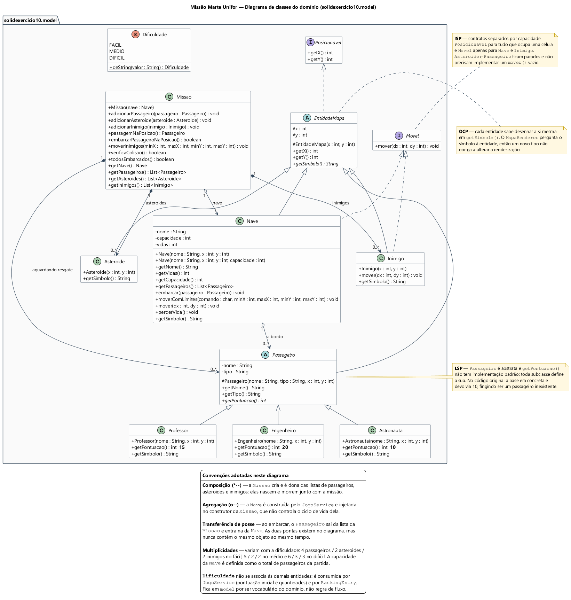
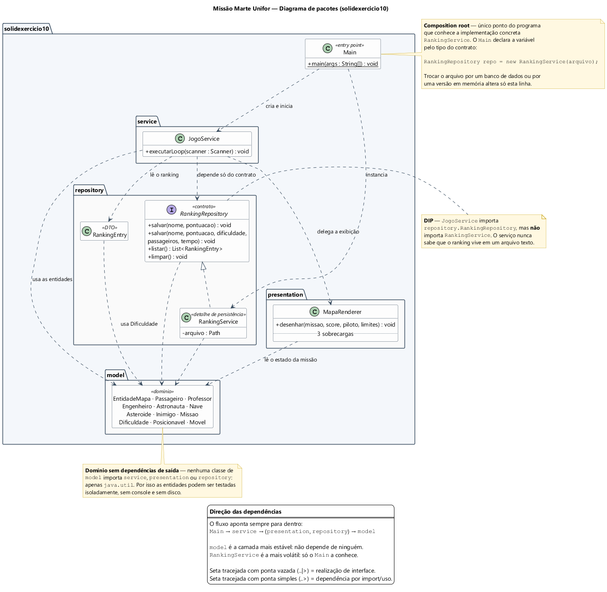

# Missão Marte Unifor — Refatoração SOLID (Grupo 7)

Atividade prática de refatoração em Java. O jogo de console original foi
preservado em [`src/exercicio10`](src/exercicio10) e a versão refatorada,
organizada em camadas e guiada pelos princípios SOLID, está em
[`src/solidexercicio10`](src/solidexercicio10).

## Equipe

| Integrante            | Matrícula | Usuário Git     | Responsabilidade                                      |
| --------------------- | --------- | --------------- | ----------------------------------------------------- |
| Samuel Miguel Barbosa | 2517428   | SamuelBarbosa11 | Refatoração principal, `Main`, integração das camadas |
| João Gabriel Rinaldi  | 2510365   | JgRM0           | Entidades do domínio, OCP/LSP/ISP e diagramas UML     |
| Rafael Dantas         | 2517979   | r-dantas9       | Documentação, testes manuais e evidências             |

## Como compilar e executar

**Requisito:** JDK 14 ou superior — o código usa *switch expressions*
(`case FACIL -> 8`). Recomendado o JDK 17 LTS. Um JRE sozinho não compila.

Na raiz do projeto, no Windows:

```cmd
run start
```

No PowerShell (shell padrão do Windows Terminal), use `.\run start`: o
PowerShell não executa scripts da pasta atual sem o prefixo `.\`. Para a
demonstração, prefira o Windows Terminal, que exibe corretamente os emojis do
mapa.

O script cria a pasta `out`, configura UTF-8, compila os cinco pacotes de
`solidexercicio10` e inicia `solidexercicio10.Main`.

Manualmente, se preferir:

```cmd
javac -encoding UTF-8 -d out src\solidexercicio10\*.java src\solidexercicio10\model\*.java src\solidexercicio10\presentation\*.java src\solidexercicio10\repository\*.java src\solidexercicio10\service\*.java
java -Dfile.encoding=UTF-8 -cp out solidexercicio10.Main
```

No Linux:

```bash
javac -encoding UTF-8 -d out src/solidexercicio10/*.java src/solidexercicio10/model/*.java src/solidexercicio10/presentation/*.java src/solidexercicio10/repository/*.java src/solidexercicio10/service/*.java
java -Dfile.encoding=UTF-8 -cp out solidexercicio10.Main
```

Para comparar com a versão original:

```cmd
javac -encoding UTF-8 -d out-original src\exercicio10\*.java
java -Dfile.encoding=UTF-8 -cp out-original exercicio10.Main
```

## Diagramas UML

Os arquivos-fonte (`.puml`) e as imagens geradas (`.png`) estão em
[`docs/uml/`](docs/uml). Os diagramas descrevem a **estrutura real
implementada**, e não a estrutura sugerida pelo tutorial.

### 1. Diagrama de classes do domínio

Fonte: [`docs/uml/diagrama-classes-model.puml`](docs/uml/diagrama-classes-model.puml)



Representa o pacote `solidexercicio10.model` e as decisões de modelagem que
sustentam os princípios de extensão e substituição:

- **`EntidadeMapa` como raiz abstrata.** Tudo que ocupa uma célula do mapa
  herda dela e é obrigado a responder `getSimbolo()`. É isso que permite ao
  `MapaRenderer` desenhar o mapa perguntando o símbolo a cada entidade, em vez
  de manter uma cadeia de `if/else` por tipo — **OCP**: um novo tipo de
  entidade não obriga a alterar a renderização.

- **`Passageiro` abstrata, com `getPontuacao()` sem implementação padrão.**
  No código original a classe base era concreta e devolvia 10 pontos, ou seja,
  a base representava um passageiro que não existe no jogo, e `Professor`
  apenas repetia o mesmo valor. Tornando-a abstrata, cada subclasse é obrigada
  a declarar sua pontuação (Professor 15, Engenheiro 20, Astronauta 10) e
  qualquer uma pode substituir a base sem surpresa para `Missao` e
  `JogoService` — **LSP**.

- **Dois contratos pequenos em vez de um grande.** `Posicionavel` (`getX`,
  `getY`) descreve o que ocupa uma posição; `Movel` (`mover`) descreve o que
  se desloca. Só `Nave` e `Inimigo` implementam `Movel`, então `Asteroide` e
  `Passageiro` não precisam carregar um `mover()` vazio — **ISP**.

- **Composição e agregação diferenciadas.** A `Missao` cria e é dona das
  listas de passageiros, asteroides e inimigos (composição): elas nascem e
  morrem com a missão. Já a `Nave` é construída pelo `JogoService` e injetada
  no construtor da `Missao` (agregação), que portanto não controla o ciclo de
  vida dela.

- **Transferência de posse no embarque.** O `Passageiro` aparece ligado tanto
  à `Missao` (aguardando resgate) quanto à `Nave` (a bordo). As duas pontas
  existem, mas nunca contêm o mesmo objeto ao mesmo tempo: ao embarcar, ele
  sai da lista da missão e entra na da nave.

- **Multiplicidades por dificuldade.** 4 passageiros / 2 asteroides /
  2 inimigos no fácil, 5 / 2 / 2 no médio e 6 / 3 / 3 no difícil. A capacidade
  da `Nave` é definida como o total de passageiros da partida.

- **`Dificuldade` isolada.** O enum não se associa a nenhuma outra entidade do
  domínio: ele é consumido por `JogoService` (pontuação inicial e quantidade
  de entidades) e por `RankingEntry` (registro da partida). Permanece em
  `model` por ser vocabulário do domínio, não regra de fluxo.

### 2. Diagrama de pacotes

Fonte: [`docs/uml/diagrama-pacotes.puml`](docs/uml/diagrama-pacotes.puml)



Mostra as cinco divisões do projeto e a direção das dependências, que apontam
sempre para dentro: `Main` → `service` → (`presentation`, `repository`) →
`model`.

- **`model` é a camada mais estável.** Nenhuma classe do domínio importa
  `service`, `presentation` ou `repository` — apenas `java.util`. Por isso as
  entidades podem ser testadas isoladamente, sem console e sem disco.

- **O serviço depende do contrato, não do detalhe — DIP.** `JogoService`
  importa `repository.RankingRepository`, mas **não** importa
  `RankingService`. O serviço nunca sabe que o ranking vive em um arquivo de
  texto. No diagrama, a interface aparece no topo do pacote `repository` e a
  implementação concreta logo abaixo dela, justamente para tornar essa direção
  visível.

- **`Main` é o *composition root*.** É o único ponto do programa que conhece a
  implementação concreta, e declara a variável pelo tipo do contrato:
  `RankingRepository repo = new RankingService(arquivo)`. Trocar a persistência
  por um banco de dados ou por uma versão em memória altera apenas essa linha.

- **`presentation` só lê o estado da missão.** O `MapaRenderer` recebe a
  `Missao` e os limites do mapa e desenha; ele não decide nada sobre a regra do
  jogo — **SRP**.

### Como regenerar as imagens

Os `.png` foram gerados com o PlantUML 1.2024.7, que já traz o Graphviz
embutido (não é preciso instalar o Graphviz separadamente):

```bash
java -jar plantuml.jar -charset UTF-8 -tpng docs/uml/diagrama-classes-model.puml docs/uml/diagrama-pacotes.puml
```

O `-charset UTF-8` é necessário porque os diagramas contêm acentuação; sem ele
o PlantUML assume a codificação padrão do sistema (Cp1252 no Windows) e os
rótulos saem corrompidos.

## Alterações realizadas

A versão original concentrava o jogo inteiro em `src/exercicio10/Main.java`:
557 linhas e mais de vinte métodos estáticos, indo do menu até a gravação do
arquivo de ranking. Na versão refatorada esse conteúdo foi distribuído em cinco
pacotes e o `Main` ficou com 23 linhas.

| Responsabilidade               | Antes (`exercicio10`)                          | Depois (`solidexercicio10`)              |
| ------------------------------ | ---------------------------------------------- | ---------------------------------------- |
| Menu e fluxo da partida        | `Main.exibirMenu`, `Main.jogarPartida`         | `service.JogoService`                    |
| Desenho do mapa                | `Main.desenharMapa`                            | `presentation.MapaRenderer`              |
| Leitura e gravação do ranking  | `Main.loadRanking`, `saveRanking`, `parseRankingJson` | `repository.RankingService`       |
| Entidades e regras do domínio  | classes soltas no pacote `exercicio10`         | pacote `model`                           |
| Composição das dependências    | não existia                                    | `Main`                                   |

### Mudanças no domínio

- **`EntidadeMapa` criada como raiz abstrata.** Antes, `Nave`, `Asteroide`,
  `Inimigo` e `Passageiro` repetiam cada um os próprios campos `x` e `y` com os
  mesmos getters.

- **`Passageiro` passou de concreta para abstrata**, com `getPontuacao()`
  abstrato. Antes a base devolvia 10 pontos por padrão e `Professor`
  sobrescrevia com o mesmo valor. As pontuações atuais são Professor 15,
  Engenheiro 20 e Astronauta 10.

- **`Posicionavel` e `Movel` introduzidas**, separando o que ocupa uma posição
  do que se desloca.

- **O desenho do mapa deixou de depender de `instanceof`.** O `desenharMapa`
  original escolhia o símbolo testando o tipo do objeto:

  ```java
  if (p instanceof Engenheiro) {
      symbol = 'E';
  } else if (p instanceof Astronauta) {
      symbol = 'T';
  } else {
      symbol = 'P';
  }
  ```

  Agora cada entidade responde `getSimbolo()` e o `MapaRenderer` apenas
  pergunta. Um tipo novo de entidade não exige tocar na renderização.

- **A colisão saiu das entidades e foi para a missão.** `Asteroide.colideCom(Nave)`
  e `Inimigo.colideCom(Nave)` foram substituídos por `Missao.verificaColisao()`,
  deixando os perigos como entidades de posição e concentrando a regra em quem
  conhece o tabuleiro.

- **`Missao.moverInimigos` recebe os limites do mapa** e impede que os inimigos
  deixem a área jogável. Detalhes e medições em [REVISAO-SOLID.md](REVISAO-SOLID.md).

### Mudanças de comportamento visíveis

- Os símbolos do mapa passaram de caracteres ASCII (`@`, `P`, `E`, `T`, `#`)
  para emojis.
- O eixo vertical foi invertido internamente: o mapa é desenhado de `maxY` para
  `minY` e `w` passou a aumentar `y`. Na tela o efeito é o mesmo de antes —
  `w` sobe.
- O arquivo de ranking passou de `ranking.json` para
  `ranking-solid-exercicio10.json`.
- Foi acrescentada a validação de tamanho mínimo do mapa por dificuldade.
- O ranking guarda todas as vitórias e exibe as cinco melhores; o original
  gravava apenas o Top 5. O recorde e a mensagem de entrada no Top 5 continuam
  aparecendo nas estatísticas de vitória, como no original.

## Decisões de projeto

- **Manter a estrutura de camadas sugerida pelo tutorial.** O projeto é pequeno
  e a divisão `Main` / `service` / `model` / `presentation` / `repository` já
  separa os motivos de mudança sem introduzir indireção que ninguém usaria.
  Criar mais abstrações aqui custaria mais do que resolveria.

- **Persistência atrás de uma interface.** `JogoService` recebe
  `RankingRepository` no construtor e nunca conhece `RankingService`. Trocar o
  arquivo por um banco de dados ou por uma versão em memória altera apenas a
  linha de composição no `Main`, e o serviço pode ser testado com um
  repositório falso.

- **O símbolo pertence à entidade, não ao renderizador.** Foi o que permitiu
  eliminar a cadeia de `instanceof` e manter a renderização fechada para
  modificação.

- **Os limites do mapa ficam na `Missao`, não na entidade que se move.**
  `Movel.mover(dx, dy)` continua sendo um deslocamento relativo puro; quem
  conhece as bordas do tabuleiro é a missão.

- **Ajustar o mapa em vez de recusar a entrada.** Quando o jogador informa um
  tamanho menor que o necessário para a dificuldade, o programa avisa e usa o
  mínimo viável, em vez de encerrar com `IllegalStateException`.

## Estrutura do repositório

```text
src/exercicio10/          versão original preservada, para comparação
src/solidexercicio10/     versão refatorada (Main, model, service, presentation, repository)
test/solidexercicio10/    teste executável dos limites dos inimigos
docs/uml/                 diagramas UML (.puml e .png)
apostilas-solid/          material de apoio sobre cada princípio
REVISAO-SOLID.md          revisão crítica da solução e testes realizados
Atividade.md              enunciado e roteiro da atividade
run.cmd                   script de compilação e execução no Windows
```

## Documentos relacionados

- [REVISAO-SOLID.md](REVISAO-SOLID.md) — revisão crítica, achados e testes.
- [src/solidexercicio10/README.md](src/solidexercicio10/README.md) — detalhes da
  versão refatorada, regras do jogo e testes manuais recomendados.
- [src/README.md](src/README.md) — tutorial passo a passo da refatoração.
- [Divisao-Tarefas-Integrantes.md](Divisao-Tarefas-Integrantes.md) — divisão de
  responsabilidades da equipe.

## Evidências de teste

A lista completa, com os comandos e resultados, está em
[REVISAO-SOLID.md](REVISAO-SOLID.md#como-validei-a-solução). Em resumo:

| Verificação                                   | Como foi feita                                      | Resultado                                      |
| --------------------------------------------- | --------------------------------------------------- | ---------------------------------------------- |
| Compilação das duas versões                   | `javac` do original e da refatorada                 | Sem erros                                      |
| Menu, partida, embarque, vitória, ranking e reset | Partidas manuais pelo `run start`               | Fluxo igual ao original                        |
| Aborto com `q` e comando inválido             | Seis partidas no mapa mínimo, todas as células ocupadas | Nenhuma colisão depois do comando          |
| Mapa menor que o necessário                   | Tamanho 0 e 1 no difícil                            | Ajuste automático para o mínimo, sem exceção   |
| Limites dos inimigos                          | [`TesteLimitesInimigos`](test/solidexercicio10/TesteLimitesInimigos.java), 20.000 rodadas | Antes: ~59.500 posições fora do mapa; depois: 0 |
| Recorde e Top 5 nas estatísticas              | Ranking vazio, pontuação acima e abaixo do 1º lugar | Mensagem correta nos três casos                |
| Ranking com linhas malformadas                | Arquivo com nome contendo `\|` e pontuação inválida | Linhas inválidas ignoradas, ranking exibido    |

Para repetir o teste de limites:

```bash
javac -encoding UTF-8 -d out-teste src/solidexercicio10/model/*.java test/solidexercicio10/TesteLimitesInimigos.java
java -Dfile.encoding=UTF-8 -cp out-teste solidexercicio10.TesteLimitesInimigos
```

## Limitações que permanecem

A refatoração resolveu os problemas de acoplamento do `Main` original, mas
alguns pontos ficaram de fora do escopo desta entrega. Todos estão detalhados,
com princípio e prioridade, em [REVISAO-SOLID.md](REVISAO-SOLID.md).

- **Sem testes automatizados do fluxo.** `JogoService` lê do `Scanner` e
  escreve em `System.out` diretamente, e a `Missao` sorteia com
  `Math.random()`. Por isso o fluxo da partida só é verificado manualmente; o
  único teste executável cobre o movimento dos inimigos.
- **`JogoService` ainda concentra várias tarefas**: menu, leitura da entrada,
  montagem da missão, pontuação e encerramento. Para o tamanho atual isso é
  aceitável; se o jogo crescer, a criação da missão deveria ir para uma
  `MissaoFactory`.
- **Criação de passageiros fixa.** Embarque e pontuação são polimórficos, mas
  o serviço sempre cria a mesma sequência de Professor e Engenheiro, e
  `Astronauta` existe no modelo sem nunca aparecer no jogo.
- **Tipo do passageiro guardado como texto**, sem vínculo com a classe real.
- **Contratos maiores do que o uso.** `Nave` implementa `Movel` sem cliente para
  `mover()`, `RankingRepository` tem uma sobrecarga de `salvar` que ninguém
  chama e há métodos públicos sem uso em `JogoService`, `MapaRenderer` e `Nave`.
- **Persistência simples.** O arquivo tem extensão `.json`, mas é texto
  separado por `|`; ele guarda todas as vitórias (o original guardava só o
  Top 5) e cresce sem limite. Falhas de leitura em `salvar` são ignoradas: se o
  arquivo existir mas não puder ser lido (por exemplo, salvo em outra
  codificação que não UTF-8), a próxima vitória sobrescreve o histórico.
- **Mapa mínimo muito cheio.** No fácil com o tamanho mínimo (3x3), as oito
  casas em volta da nave ficam ocupadas e um inimigo pode colidir já na
  primeira rodada.
- **Símbolos dependem do terminal.** Os emojis do mapa exigem um console com
  UTF-8 e fonte com suporte a emoji (Windows Terminal, por exemplo); no
  `cmd` antigo podem aparecer desalinhados.
